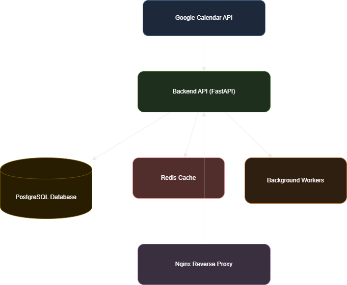
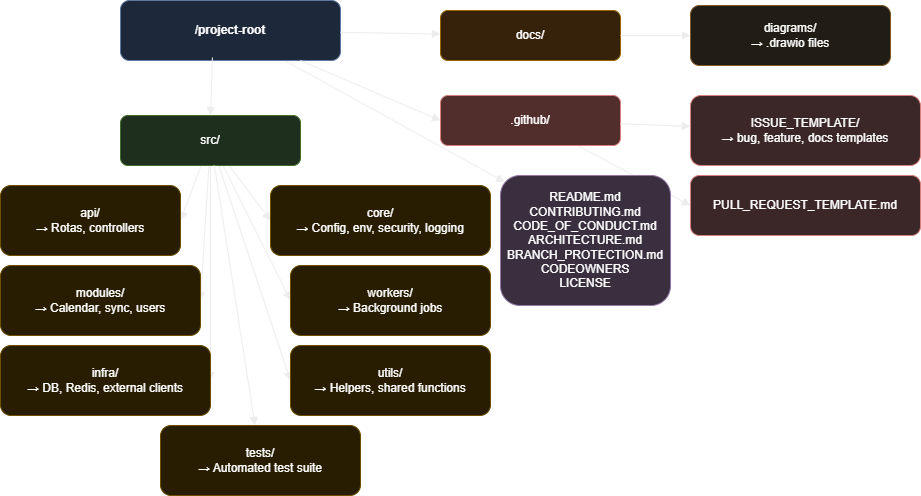

# System Architecture Overview

This document describes the architectural design of the Google Calendar Sync project.  
The goal is to provide a clear, scalable, and maintainable structure, using only open-source tools and best security practices.

---

# 🎯 Architectural Goals

- Secure interaction with Google APIs  
- Clear separation between modules  
- FastAPI service with modular design  
- Easy future expansion and team handoff  
- Clean layered architecture  
- Local infrastructure using Docker  
- Lightweight background workers

---

# 🏛️ High-Level Architecture

  <h3>High-Level System Architecture</h3>

  

---

# 🧱 Folder Structure

  <h3>Folder Structure</h3>

  

---

# 🔐 Security Considerations

- OAuth2 token encryption before storing
- Rate limiting using Redis
- Secrets stored in environment variables
- HTTP-only secure cookies (optional)
- SQL injection protection via ORM
- OWASP-compliant input validation

---

# 🐳 Infrastructure (Local Only)

- Docker Compose  
- PostgreSQL + Adminer  
- Redis  
- Nginx reverse proxy  
- Optional Keycloak service  

---

# 📈 Scalability Considerations

Even though this is a small academic project:

- Stateless API → easily horizontally scalable  
- Workers can scale independently  
- Caching layer prevents overload  
- Nginx allows load balancing  

---

# 🧪 Testing Strategy

- Unit tests for business logic  
- Integration tests for API endpoints  
- Mock Google API calls  
- CI pipeline using GitHub Actions

---

# 📌 Future Enhancements

- Metrics (Prometheus)
- Dashboard frontend
- Multi-account synchronization
- Fine-grained RBAC
- Webhooks for real-time updates
